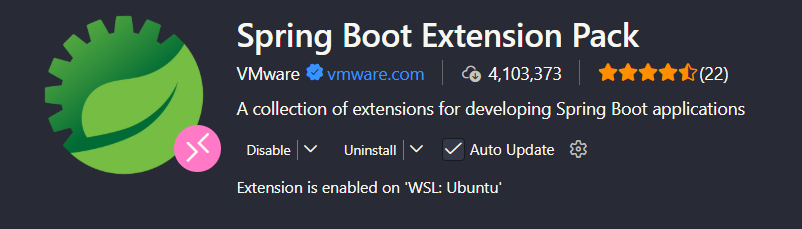
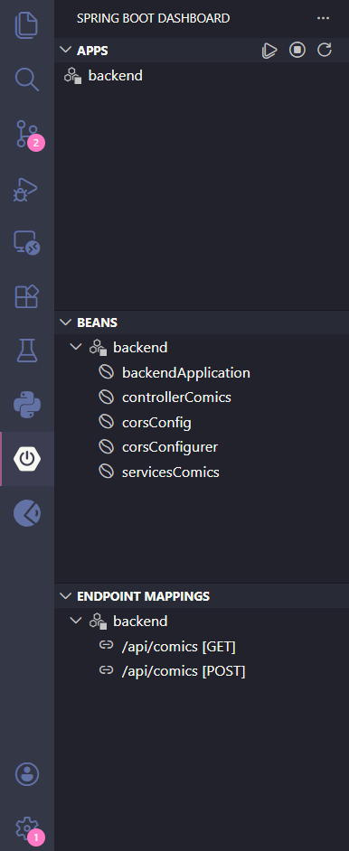

# Forms App Web

Aplicación web con backend en Spring Boot y frontend en React + Vite.
Lógica de creación de comics en un inventario y mostrar la lista de todos los comics creados

## Backend (Spring Boot)

### Requisitos
- Java 17+
- Maven (o usar el wrapper incluido `mvnw`)

### Opción 1: Correr con VS Code

1. Instala la extensión **Spring Boot Extension Pack** (de VMware)

2. Abre la carpeta `backend/` en VS Code
3. En el panel izquierdo, clic en el ícono de Spring Boot (🍃)
4. En **APPS**, aparecerá `BackendApplication`
5. Clic en el botón ▶ para iniciar


### Opción 2: Correr por terminal

```bash
cd backend
./mvnw spring-boot:run